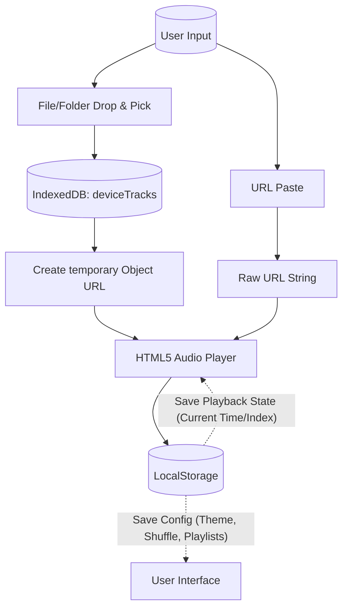

# JUST PLAY IT. – Logic Map & Architecture Guide

This document serves as a comprehensive 1-to-5 page logic map of the **JUST PLAY IT.** PWA. It breaks down the user interface, underlying logic, data flow, and core functions systematically.

---

## 1. Application Overview

**JUST PLAY IT.** is an installable, offline-first Progressive Web App (PWA) designed to play both local audio files (from the user's device) and remote audio URLs. 

### Key Characteristics:
*   **Privacy-First:** No accounts, no sign-ins, and no cloud storage. All audio files and "Saved Playlists" are stored entirely within the user's browser using `IndexedDB` and `localStorage`.
*   **Installable:** Functions like a native app on mobile and desktop via the Web App Manifest and Service Worker.
*   **Offline Capable:** Local files are playable without an internet connection. Built-in caching handles the app shell.

---

## 2. Visual Interface & Layout

The user interface follows a single-page, vertically scrolling logic, prioritizing immediate access to the audio player, current queue, and playlist management.

*Figure 1: The main player view, highlighting the core playback controls and "Now Playing" status.*

### A. The App Shell & Topbar
*   **Component:** Fixed at the top of the screen.
*   **Logic:** Houses the "JUST PLAY IT." brand logo (which spins on initial load), the PWA "Install" button (visible only if the app isn't installed), and the Hamburger menu button opening the Sidebar.

### B. The Player Card (Now Playing)
*   **Component:** The central focus area.
*   **Logic:** 
    *   Displays the currently loaded track.
    *   **Vinyl Record Cover Art:** Acts as a dynamic element. Clickable to load files when empty, and spins with a CSS animation when audio is actively playing.
    *   **Transport Controls:** Play/Pause, Next/Previous, Skip Back/Forward (±30s), Shuffle, and Repeat mode toggles.
    *   **Seek Bar:** An interactive range input that scrubs through the track, continually updated via the `timeupdate` event from the `<audio>` element.

---

## 3. Queue & Playlist Management

Below the player card, the application handles active playback queues (Current Playlist) and stored queues (Saved Playlists).

### C. Current Playlist (The Queue)
*   **Component:** A collapsible list of the currently loaded tracks awaiting playback.
*   **Logic (`playlist` array):** 
    *   Maintains an array of objects containing `id`, `title`, `sourceType` (file or url), and `duration`.
    *   **Edit Mode:** Users can toggle "Edit" to dynamically re-order tracks via Drag & Drop or remove them entirely.
    *   **Green/Red Light System:** Each track has an enable/disable toggle. "Red Lighted" tracks are skipped during sequential playback and shuffle selection logic.
    *   **Persistence:** The `playlist` and `currentTrackIndex` are pushed to `localStorage` on page unload and pulled on initialization so playback can gracefully resume.

### D. Saved Playlists & Data Handling
*   **Component:** A unified action block for saving, loading, renaming, and deleting grouped track lists.
*   **Logic (`savedPlaylists` object):**
    *   When the user saves the "Current" list, the app serializes the track data (stripping active states) into `localStorage`.
    *   **Built-in Playlists:** Injected at runtime from `builtin-playlists.json` providing curated starter tracks (e.g., "Remember the Lord", "Jonah's Songs"). These are read-only to prevent accidental deletion.
    *   **Import/Export:** Converts `savedPlaylists` to/from a physical `.json` file for backup/migrations across devices.

---

## 4. Input Sources & Storage Map

The application is heavily reliant on the browser's storage APIs to achieve an "offline library" feel without a backend server.

### Storage Architecture diagram:

### E. Adding Audio (Drop Zone)
*   **Component:** A "Drop Zone" area, file picker, and URL text input.
*   **Logic:**
    1.  **File Processing (`addFileTracks`):** When files are selected/dropped, the system loops through them, verifying they match valid audio extensions.
    2.  **Duration Extraction:** A background hidden `Audio` context pre-calculates the duration (`loadedmetadata`) so the UI displays accurate times before the user hits play.
    3.  **IndexedDB Storage (`saveTrackBlob`):** The physical `File` Blob is transferred into a permanent `IndexedDB` record under `deviceTracks`. 
    4.  **Playback Bridge (`resolveTrackSource`):** When it's time to play a stored file, the app generates a temporary `URL.createObjectURL()` pointing directly to the IndexedDB Blob so the HTML5 `<audio>` tag can read it as a standard source.

---

## 5. The Sidebar (Settings & Library)

The sidebar slides out as a global settings and library dashboard.

### F. Sidebar Sub-sections
*   **Support & Gold Member:** Fixed prominent donation access linked to Ko-Fi, styled deeply red for urgency.
*   **Library Collapsible:** Displays all tracks currently stored locally inside `IndexedDB`. Allows users to selectively build playlists from their device storage. Shows real-time storage weight via standard `navigator.storage` methods.
*   **Config Toggles:** Sleep Timer (creates a `setTimeout` to trigger the `audio.pause()` function), Dark/Light Mode, QR Code generator (via iframe API for quick mobile sharing).
*   **Rearrange Mode:** Allows the user to change the physical order of sidebar components, with the preferred order saved to `localStorage` and mapped dynamically via `applySidebarOrder()`.

---

## Summary of Core State Mechanisms
If you are modifying functionality, be aware of these interconnected variables in `app.jsx`:
1.  **`playlist`**: The active array of tracks determining what the Play/Next/Prev buttons do.
2.  **`currentTrackIndex`**: An integer pointer referencing which array position in `playlist` is actively assigned to the HTML5 `<audio>` element. 
3.  **`savedPlaylists`**: An overarching dictionary grouping multiple track arrays under string keys (names) for future recall.
4.  **`audio.src`**: The absolute single source of truth for the physical file being played. Controlled by `loadTrack()`.
